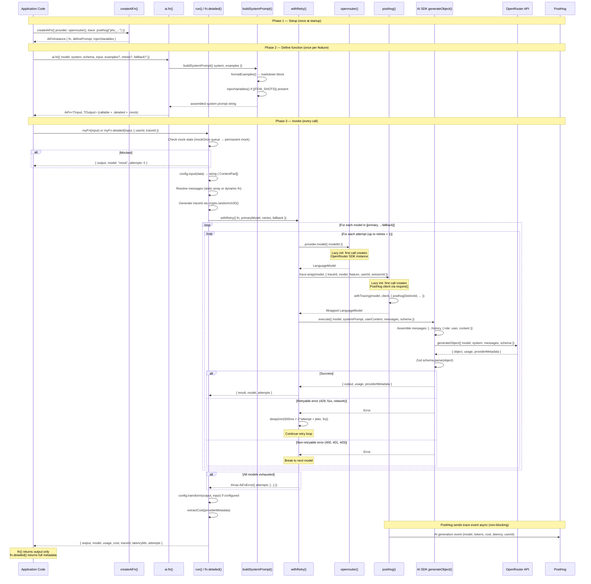
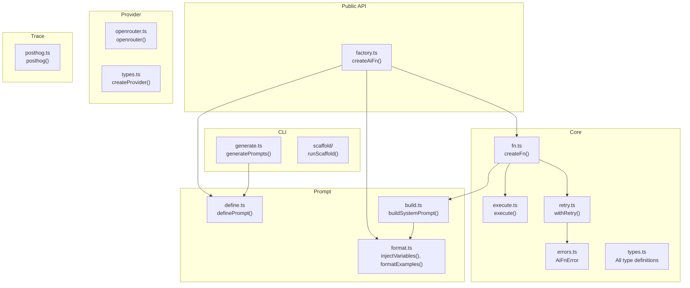

# How It Works — funcai Deep Internals

## Executive Summary

**What this is:** `funcai` turns any Zod schema into a callable, typed async function that returns validated structured output from an LLM. You define what you want back, and it handles the rest — model selection, retry with exponential backoff, fallback chains, multimodal input, cost tracking, and observability.

**How it works in 30 seconds:**

1. `createAiFn({ provider, trace })` — bind a provider (OpenRouter) and optional tracing (PostHog)
2. `ai.fn({ model, system, schema, input })` — define a function: what model, what instructions, what output shape, how to format input
3. `await myFn(data)` — call it. Input gets formatted, system prompt gets assembled (with few-shots if any), the model is called via AI SDK's `generateObject`, output is Zod-validated, optionally transformed, and returned typed
4. If it fails → retry with backoff → fall back to next model → throw `AiFnError` with full attempt history

**The tech:** Built on [Vercel AI SDK](https://sdk.vercel.ai/) `generateObject`. OpenRouter as the default provider. PostHog for tracing. Zero classes — factory functions and closures all the way down. Dual ESM/CJS build via tsup.

**Who this doc is for:** Contributors, AI coding agents picking up development, and anyone wanting a deep understanding of the internals. If you just want to use the library, see [README.md](./README.md).

---

## Table of Contents

- [End-to-end sequence diagram](#end-to-end-sequence-diagram)
- [Architecture overview](#1-architecture-overview)
- [Design decisions](#2-design-decisions)
- [Content type system](#3-content-type-system)
- [Execution flow](#4-execution-flow)
- [Retry strategy](#5-retry-strategy)
- [Provider system](#6-provider-system)
- [Trace system](#7-trace-system)
- [CLI codegen](#8-cli-codegen)
- [Build and distribution](#9-build-and-distribution)
- [Testing architecture](#10-testing-architecture)
- [Extending the library](#11-extending-the-library)

---

## End-to-end sequence diagram

This covers the full lifecycle: creating an instance, defining a function, invoking it, retry/fallback, OpenRouter integration, and PostHog tracing.



---

## 1. Architecture Overview

The library is organized into five layers, each with a single responsibility. Dependencies flow strictly downward.



### Layer descriptions

| Layer | Purpose | Key files |
|-------|---------|-----------|
| **Core** | The execution engine. Factory, function builder, retry logic, AI SDK integration, error types, all shared types. | `factory.ts`, `fn.ts`, `execute.ts`, `retry.ts`, `errors.ts`, `types.ts` |
| **Prompt** | Prompt assembly. Create prompts (`definePrompt`), assemble with examples (`buildSystemPrompt`), template formatting (`injectVariables`, `formatExamples`). | `define.ts`, `build.ts`, `format.ts` |
| **Provider** | Model instantiation. Adapts AI services (OpenRouter, custom) into the `Provider` interface that core consumes. | `openrouter/provider.ts`, `types.ts` |
| **Trace** | Observability. Implements `TracePlugin` to wrap models with monitoring (PostHog). | `posthog.ts` |
| **CLI** | Code generation and scaffolding. Reads `.prompt.md` files → TypeScript. Scaffolds feature folders. Standalone from runtime. | `generate.ts`, `scaffold/` |

### File tree

```
src/
├── index.ts                          # Public re-exports
├── core/
│   ├── factory.ts                    # createAiFn() — the entry point
│   ├── fn.ts                         # createFn() — builds callable AI functions
│   ├── execute.ts                    # execute() — calls AI SDK generateObject
│   ├── retry.ts                      # withRetry() — retry + fallback logic
│   ├── errors.ts                     # AiFnError with attempt history
│   └── types.ts                      # All shared TypeScript types
├── prompt/
│   ├── define.ts                     # definePrompt() — create prompt configs
│   ├── build.ts                      # buildSystemPrompt() — assemble with examples
│   └── format.ts                     # injectVariables(), formatExamples()
├── provider/
│   ├── types.ts                      # createProvider() helper
│   └── openrouter/
│       ├── provider.ts               # openrouter() factory with lazy init
│       ├── models.ts                 # Curated model registry (auto-generated)
│       └── index.ts                  # Re-exports
├── trace/
│   └── posthog.ts                    # PostHog trace plugin
└── cli/
    ├── generate.ts                   # .prompt.md → .prompt.ts codegen
    ├── watcher.ts                    # --watch mode for generate
    ├── utils.ts                      # toCamelCase, shared CLI utilities
    └── scaffold/
        ├── index.ts                  # runScaffold() entry point
        ├── prompts.ts                # Interactive TUI prompts
        ├── templates.ts              # File templates for scaffolded features
        ├── ai-generate.ts            # AI-powered content generation (dogfooding)
        └── types.ts                  # Scaffold config types
test/
├── index.ts                          # Re-exports test utilities
├── mock.ts                           # track(), unmockAll(), isMocked()
└── helpers.ts                        # validateExamples()
bin/
└── funcai.ts                           # CLI entry point
```

---

## 2. Design Decisions

### Factory pattern over class hierarchy

`createAiFn()` returns a plain object with three methods: `definePrompt`, `fn`, and `injectVariables`. No classes, no inheritance, no `this` binding issues. The factory closes over shared context (provider, trace plugin, default retries) and passes it to each `createFn` call. This makes the instance immutable after creation and avoids the fragile base class problem.

### Phantom types for model ID propagation

The `Provider` type carries a phantom generic `TModelId`:

```typescript
type Provider<TModelId extends string = string> = {
  model: (config: { modelId: string }) => LanguageModel;
  __modelId?: TModelId;  // never set at runtime
};
```

`ModelIdOf<P>` extracts this type so that `definePrompt` can narrow the `model` field to the provider's known model IDs. The `openrouter()` factory returns `Provider<OpenRouterModelId>`, which means `ai.definePrompt({ model: "..." })` gets autocomplete for all OpenRouter model IDs. The phantom field `__modelId` is never assigned a value — it exists purely for the type system.

### Lazy initialization for providers

Both `openrouter()` and `posthog()` defer SDK instantiation until the first call to `model()` or `wrap()`. This avoids importing heavy SDKs at module load time, keeps startup fast, and means unused providers never touch the network or allocate memory.

### `require()` for optional peer deps

PostHog (`posthog-node`, `@posthog/ai`) and the OpenRouter SDK are loaded via synchronous `require()` (created from `createRequire(import.meta.url)` for ESM compat) inside the lazy initialization path. This is intentional:

1. **Tree-shaking**: The imports are not statically analyzable, so bundlers exclude them when the entry point is not used. `tsup.config.ts` marks them as `external`.
2. **Optional peers**: PostHog packages are declared in `peerDependenciesMeta` as optional. A consumer who never uses the `posthog()` trace plugin never needs to install them. A static `import` would cause a hard failure at module load.
3. **CJS compatibility**: `require()` works in both the ESM and CJS output formats without additional interop.

### Separate `definePrompt` from `fn`

Prompts are decoupled from functions. A single `PromptConfig` object (id, model, system, temperature, maxTokens) can be shared across multiple `fn()` calls, or swapped at runtime for A/B testing. The `fn()` config also accepts inline `model` + `system` for one-off cases where a separate prompt definition adds no value.

### `generateObject` as the core, not `generateText`

The entire library is built around AI SDK's `generateObject()`. This is the fundamental design choice: every AI function returns structured, Zod-validated output. There is no `generateText` path. The Zod schema is passed directly to the AI SDK, which uses it to constrain model output (via tool calling or JSON mode depending on the provider). This eliminates manual JSON parsing, regex extraction, and post-hoc validation.

### Dual ESM/CJS build

`tsup` produces both `.js` (ESM) and `.cjs` (CJS) for every entry point. The `package.json` exports map uses conditional exports with separate `import` and `require` conditions. This supports consumers on both module systems without forcing a choice.

### `{{FEW_SHOTS}}` placeholder pattern

`buildSystemPrompt` checks for a literal `{{FEW_SHOTS}}` string in the system prompt. If present, formatted examples are injected at that exact position. If absent, examples are appended to the end. This gives prompt authors control over where examples appear in the system prompt without requiring them to think about it if they do not care about placement.

### Closure-scoped mock state

Each `createFn` call creates a fresh closure with its own `mockImpl` and `mockOnceQueue`. This means mocking one AI function never interferes with another. The `.mock()`, `.mockOnce()`, `.unmock()`, and `.isMocked` methods are attached directly to the callable function, so the test API is `myFn.mock(...)` — no wrapper objects, no test framework dependency.

---

## 3. Content Type System

The `input` function can return either a `string` (text-only) or a `ContentPart[]` (multimodal). The content type union covers four part types:

```typescript
type TextPart  = { type: 'text';  text: string };
type ImagePart = { type: 'image'; image: string | URL | Buffer };
type AudioPart = { type: 'audio'; audio: Buffer | string };
type FilePart  = { type: 'file';  data: string | URL | Uint8Array | ArrayBuffer | Buffer; mediaType: string; filename?: string };

type ContentPart = TextPart | ImagePart | AudioPart | FilePart;
```

### How content flows through the pipeline

```
input(data) → string | ContentPart[]
    │
    ▼
toSdkMessage()
    │  Content passes through directly to the AI SDK.
    │  No casting, no string coercion — the SDK's UserContent
    │  type accepts both string and Array<TextPart | ImagePart | FilePart>.
    ▼
AI SDK generateObject()
    │  The SDK handles all encoding and transport:
    │  - URL strings/objects → fetched and base64-encoded
    │  - Buffer/Uint8Array → base64-encoded inline
    │  - mediaType → MIME negotiation with the provider
    ▼
Structured output (Zod-validated)
```

### Type safety in message conversion

`toSdkMessage()` converts our `Message` type to the AI SDK's `ModelMessage` format. The content field passes through without casting:

```typescript
function toSdkMessage(msg: {
  role: 'user' | 'assistant';
  content: string | ContentPart[];
}): ModelMessage {
  if (msg.role === 'user') {
    return { role: 'user', content: msg.content } as ModelMessage;
  }
  return { role: 'assistant', content: msg.content } as ModelMessage;
}
```

The `as ModelMessage` cast is necessary because the AI SDK's message types use branded/internal types that are not structurally assignable from our types, but at runtime the shapes are identical. The important thing is that `content` itself is never coerced — `string` stays `string`, `ContentPart[]` stays `ContentPart[]`.

### FilePart details

`FilePart` mirrors the AI SDK v6 `FilePart` interface. The `data` field accepts the same union as `DataContent | URL`:

| `data` value | How the SDK handles it |
|---|---|
| `URL` object | SDK fetches the URL, reads the response, sends as base64 |
| `string` | Treated as base64-encoded data |
| `Buffer` / `Uint8Array` / `ArrayBuffer` | Encoded to base64 inline |

The `mediaType` field (e.g., `"application/pdf"`, `"image/png"`, `"audio/ogg"`) tells the provider what kind of file it is. The optional `filename` field is metadata — some providers use it for display but it does not affect processing.

### Model compatibility

Not all models support all content types. Provider behavior:

| Content type | Models that support it |
|---|---|
| `TextPart` | All models |
| `ImagePart` | Vision models: `openai/gpt-4o*`, `google/gemini-2.5-*`, `anthropic/claude-*` |
| `FilePart` (PDF) | `google/gemini-2.5-flash`, `google/gemini-2.5-pro`, `anthropic/claude-*`, `openai/gpt-4o*` |
| `AudioPart` | `google/gemini-2.5-*` (native audio), models with Whisper pre-processing |

The library does not validate model capabilities — it passes content through and lets the provider return an error if the model does not support the content type. This keeps the library model-agnostic.

---

## 4. Execution Flow

When a consumer calls `fn(input)`, the following sequence executes:

```
fn(input)
  |
  v
1. Check mock state                -- mockOnce queue (FIFO) > permanent mock > real call
  |
  v
2. config.input(input)             -- Transform TInput into user content (string or ContentPart[])
  |
  v
3. config.messages                  -- Resolve message chain (static array or dynamic function)
  |
  v
4. withRetry({                     -- Wrap execution in retry + fallback logic
  |   fn: async (modelId) => {
  |     |
  |     v
  |   5. provider.model(modelId)   -- Create LanguageModel instance from provider
  |     |
  |     v
  |   6. trace.wrap(model, ctx)    -- Wrap model with trace plugin (if configured)
  |     |
  |     v
  |   7. execute({                 -- Call AI SDK's generateObject
  |        model, systemPrompt,
  |        userContent, messages,
  |        schema, temperature,
  |        maxTokens
  |      })
  |     |
  |     v
  |   8. Zod schema validation     -- AI SDK validates output against schema
  |   }
  | })
  |
  v
9. config.transform(output, input) -- Apply post-processing transform (if configured)
  |
  v
10. extractCost(providerMetadata)  -- Pull USD cost from OpenRouter metadata
  |
  v
11. Return TOutput (simple call) or DetailedResult<TOutput> (.detailed() call)
```

**Key details:**

- Steps 5-8 happen inside the retry loop. Each retry (and each fallback model) re-creates the model instance and re-wraps with tracing, ensuring trace context captures the actual model used.
- The system prompt is built once at function creation time (in `createFn`), outside the retry loop, since it does not change between attempts.
- `fn(input)` delegates to `run(input)` and strips the metadata, returning only `output`.
- `fn.detailed(input, options?)` calls `run(input, options)` and returns the full `DetailedResult`.
- `traceId` is generated via `crypto.randomUUID()` unless provided in `CallOptions`.
- Multimodal content (images, PDFs, audio) passes through the same pipeline as text. The `toSdkMessage()` function does not distinguish between content types — the AI SDK handles encoding and transport at step 7.
- Cost extraction reads `providerMetadata.openrouter.usage.cost` when present. OpenRouter always includes it; other providers return `undefined`.

---

## 5. Retry Strategy

### Retryable vs non-retryable classification

`isRetryable(error)` classifies errors into two categories:

| Retryable | Non-retryable |
|-----------|---------------|
| Status codes: 429, 500, 502, 503, 504 | 400, 401, 403, 404, 422, etc. |
| Network errors: `fetch failed`, `ECONNREFUSED` | Auth errors: `Invalid API key` |
| Message patterns: `rate limit`, `too many requests`, `timeout` | Schema validation errors |

Non-retryable errors immediately break out of the retry loop for the current model and advance to the next fallback (or throw).

### Exponential backoff with jitter

```
delay = min(500ms * 2^attempt + random(0..500ms), 5000ms)
```

- Base delay doubles each attempt: 500ms, 1000ms, 2000ms, 4000ms...
- Random jitter of 0-500ms prevents thundering herd on shared rate limits.
- Hard cap at 5000ms per wait.

### Model fallback chain

The retry system iterates through `[primaryModel, ...fallback]`. Each model gets `retries + 1` attempts (1 initial + N retries). When a model exhausts its attempts (either by hitting the retry limit on retryable errors, or by encountering a non-retryable error), the next model in the chain is tried.

### AiFnError accumulation

Every failed attempt is recorded as an `AttemptRecord` (model, error, durationMs). When all models are exhausted, `AiFnError` is thrown with the full attempt history. Consumers can inspect `error.attempts` for diagnostics and `error.lastError` for the most recent failure.

```typescript
type AttemptRecord = {
  model: string;
  error: Error;
  durationMs: number;
};

class AiFnError extends Error {
  readonly attempts: AttemptRecord[];
  readonly lastError: Error;
}
```

---

## 6. Provider System

### Interface contract

```typescript
type Provider<TModelId extends string = string> = {
  model: (config: { modelId: string }) => LanguageModel;
  __modelId?: TModelId;
};
```

A provider must implement a single method: `model()`, which takes a model ID string and returns an AI SDK `LanguageModel`. That is the entire contract.

### How `ModelIdOf<P>` propagates types

```typescript
type ModelIdOf<P> = P extends Provider<infer M> ? M : string;
```

When `createAiFn` receives a `Provider<OpenRouterModelId>`, the returned `AiFnInstance` parameterizes `definePrompt` and `fn` to accept only `OpenRouterModelId` for the `model` field. The `createProvider()` helper returns `Provider` (unparameterized, defaults to `string`), which means custom providers accept any model string.

### OpenRouter lazy initialization pattern

The `openrouter()` function captures a `let instance = null` in its closure. On the first call to `.model()`:

1. Reads API key from config or `OPENROUTER_API_KEY` env
2. Calls `createOpenRouter()` from `@openrouter/ai-sdk-provider`
3. Caches the SDK instance in the closure

Subsequent calls reuse the cached instance. This means:

- Zero overhead if the provider is created but never used.
- The OpenRouter SDK is never loaded if the consumer uses a custom provider.
- API key validation happens at first use, not at construction time.

### OpenRouter model settings

The provider applies two default plugins to every model:

- **Response healing** (`{ id: 'response-healing' }`) — auto-repairs malformed JSON responses before they reach schema validation. Enabled by default, opt out with `responseHealing: false`.
- **Usage accounting** (`{ include: true }`) — surfaces cost, cached tokens, and reasoning tokens in `providerMetadata`. Enabled by default, opt out with `usage: false`.

These are passed as the second argument to `instance.chat(modelId, modelSettings)`.

### Model registry

`src/provider/openrouter/models.ts` contains a curated registry of 55+ models with typed IDs, pricing, modalities, and capabilities. The registry is auto-generated by `scripts/update-openrouter-models.ts` (run via `pnpm update:models`), which fetches model data from the OpenRouter API. The CLI `generate` command validates model IDs against this registry and provides typo suggestions.

---

## 7. Trace System

### Plugin interface

```typescript
type TracePlugin = {
  wrap: (model: LanguageModel, context: TraceContext) => LanguageModel;
};

type TraceContext = {
  traceId: string;
  model: string;
  feature: string;
  userId?: string;
  sessionId?: string;
  properties?: Record<string, unknown>;
};
```

`wrap()` receives a `LanguageModel` and returns a `LanguageModel`. The implementation decorates the model with observability hooks without changing its behavior. This is the decorator pattern applied to the AI SDK model interface.

### PostHog plugin internals

The `posthog()` plugin accepts a string API key or a `{ apiKey, host? }` config object. It lazy-loads `posthog-node` (for the PostHog client) and `@posthog/ai` (for the `withTracing` wrapper) via `require()`.

On each `wrap()` call, `withTracing` from `@posthog/ai` intercepts `doGenerate` calls on the model, records timing and token usage, and sends trace events to PostHog asynchronously (non-blocking).

### PostHog context mapping

| TraceContext field | PostHog property |
|---|---|
| `userId` | `posthogDistinctId` |
| `traceId` | `posthogTraceId` |
| `feature` | `$ai_span_name`, `feature` |
| `model` | `$ai_model` |
| `sessionId` | `$ai_session_id` |
| `properties` | Spread into `posthogProperties` |

The client is created once (lazy) and reused across all `wrap()` calls. The consumer passes per-request context via `CallOptions` on `.detailed()`.

---

## 8. CLI Codegen

### Commands

| Command | Purpose |
|---------|---------|
| `funcai generate <dir> [--watch]` | Scan `.prompt.md` files → generate TypeScript modules |
| `funcai scaffold [--name] [--fields] [-y]` | Scaffold a complete AI feature folder |

### Markdown to TypeScript pipeline (generate)

```
.prompt.md files
  |
  v
gray-matter parse       -- Extract YAML frontmatter (id, model, temperature, maxTokens)
  |                        and markdown body (system prompt text)
  v
parsePromptFile()       -- Validate required fields (id, model), validate model against registry,
  |                        detect variant suffix from filename
  v
groupPrompts()          -- Group by base ID (e.g., search-filters.prompt.md + search-filters.exp.prompt.md)
  |
  v
generatePromptCode()    -- Emit TypeScript: import definePrompt, export const, template literal
  |
  v
generateGroupIndex()    -- For groups with variants: emit index with named exports + getPrompt() switcher
```

### Variant grouping logic

File naming convention: `{id}.prompt.md` (default) and `{id}.{variant}.prompt.md` (variant).

Example:
- `search-filters.prompt.md` — default
- `search-filters.exp.prompt.md` — variant "exp"

Both share the same frontmatter `id: search-filters`. The group index exports `searchFilters` (default) and `searchFiltersExp` (variant), plus a `getPrompt(version?)` function that dispatches by variant string.

### Model ID validation

`parsePromptFile` validates the `model` field in frontmatter against the OpenRouter model registry. If the model ID is not found, it computes string similarity (shared prefix length after the provider prefix) against same-provider models and prints a warning with up to 5 suggestions including pricing info.

### Generated code structure

Each `.prompt.md` produces a `.prompt.ts` file:

```typescript
// AUTO-GENERATED from search-filters.prompt.md — do not edit
import { definePrompt } from "funcai";

export const searchFilters = definePrompt({
  id: "search-filters",
  model: "openai/gpt-4o-mini",
  temperature: 0,
  system: `...escaped system prompt content...`,
});

export default searchFilters;
```

Groups with variants additionally produce a `{id}.prompts.ts` index file with a `getPrompt()` runtime switcher.

### Scaffold (scaffold)

The scaffold command generates a complete feature folder from templates:

- `schema.ts` — Zod schema with `.describe()` annotations
- `few-shots.ts` — Typed example pairs
- `{name}.prompt.md` — System prompt with YAML frontmatter
- `{name}.prompt.ts` — Auto-generated from the `.prompt.md`
- `index.ts` — Callable `ai.fn()` export
- `README.md` — Feature documentation
- `tests/` — Unit, integration, and E2E test files

With the `--ai` flag, the scaffold command dogfoods `funcai` itself to generate realistic content for the prompt, schema fields, and few-shot examples via an AI call.

---

## 9. Build and Distribution

### tsup dual format output

`tsup.config.ts` defines five entry points, each compiled to both ESM (`.js`) and CJS (`.cjs`):

| Entry | Output |
|-------|--------|
| `src/index.ts` | `dist/index.{js,cjs,d.ts,d.cts}` |
| `src/provider/openrouter/index.ts` | `dist/provider/openrouter.{js,cjs,d.ts,d.cts}` |
| `src/trace/posthog.ts` | `dist/trace/posthog.{js,cjs,d.ts,d.cts}` |
| `test/index.ts` | `dist/test/index.{js,cjs,d.ts,d.cts}` |
| `bin/funcai.ts` | `dist/bin/funcai.{js,cjs}` |

Build flags: `dts: true`, `splitting: true` (code-splits shared chunks in ESM), `treeshake: true`, `clean: true`.

### Package exports map

```json
{
  ".":                     { "import": { "types": "...", "default": "..." }, "require": { ... } },
  "./providers/openrouter": { "import": { ... }, "require": { ... } },
  "./trace/posthog":       { "import": { ... }, "require": { ... } },
  "./test":                { "import": { ... }, "require": { ... } }
}
```

Each export has separate `types` and `default` conditions for both `import` and `require`. This ensures TypeScript resolves the correct declaration files regardless of the consumer's `moduleResolution` setting.

### Tree-shaking considerations

- `external: ['zod', 'posthog-node', '@posthog/ai']` ensures these are never bundled into the output. `zod` is a peer dep; PostHog packages are optional peers.
- `@openrouter/ai-sdk-provider` is a runtime dependency but loaded lazily inside `openrouter()`. Consumers who import only from `funcai` (the root) and use `createProvider()` with a custom model never load OpenRouter code.
- `splitting: true` means shared code between entry points (like `types.ts`) is extracted into shared chunks rather than duplicated.

### Peer dependency strategy

| Package | Required? | Why |
|---------|-----------|-----|
| `zod` | Required peer | Consumer defines schemas — must be the same instance to avoid `instanceof` mismatches |
| `posthog-node` | Optional peer | Only needed if using `posthog()` trace plugin |
| `@posthog/ai` | Optional peer | Only needed if using `posthog()` trace plugin |

`ai` (Vercel AI SDK) is a direct dependency, not a peer. This pins the SDK version to avoid breaking changes from upstream. The library owns the `generateObject` call contract.

### Scripts

| Script | Purpose |
|--------|---------|
| `pnpm dev` | Watch mode build via tsup |
| `pnpm build` | Production build |
| `pnpm typecheck` | `tsc --noEmit` |
| `pnpm check` | Biome lint + format check |
| `pnpm fix` | Biome auto-fix |
| `pnpm test` | Unit + integration tests (vitest) |
| `pnpm test:e2e` | E2E tests with live API (needs `OPENROUTER_API_KEY`) |
| `pnpm test:coverage` | Tests with v8 coverage |
| `pnpm gate` | Full CI gate: check + typecheck + build + test |
| `pnpm update:models` | Refresh OpenRouter model registry from API |

---

## 10. Testing Architecture

### Test pyramid

```
tests/
  unit/           -- Pure function tests, no AI SDK mocking
    core/
    prompt/
    provider/
    trace/
    cli/
    test/
  integration/    -- Full pipeline tests with MockLanguageModelV3
  e2e/            -- Live API calls to OpenRouter (requires API key)
    openrouter-live.test.ts    -- Text-only structured output
    multimodal-live.test.ts    -- Image + PDF multimodal input
```

| Level | What it tests | Mocking strategy | Speed |
|-------|---------------|------------------|-------|
| **Unit** | Individual functions: `isRetryable`, `calculateDelay`, `formatExamples`, `injectVariables`, `buildSystemPrompt`, `definePrompt`, `AiFnError`, `track`/`unmockAll` | No mocking needed — pure functions | Fast |
| **Integration** | Full `createAiFn` → `fn()` → result pipeline, including multimodal content parts | `MockLanguageModelV3` from `ai/test` | Fast |
| **E2E** | Live OpenRouter calls with real models, real images, real PDFs | None — real network calls | Slow, conditional |

### MockLanguageModelV3 pattern

Integration tests use AI SDK's built-in `MockLanguageModelV3`. The standard setup:

```typescript
const mockResponse = (json: unknown) => ({
  content: [{ type: 'text', text: JSON.stringify(json) }],
  finishReason: 'stop',
  usage: { inputTokens: { total: 10 }, outputTokens: { total: 5 } },
  rawCall: { rawPrompt: '', rawSettings: {} },
  warnings: [],
});

const doGenerate = vi.fn().mockResolvedValue(mockResponse({ key: 'value' }));
const model = new MockLanguageModelV3({ doGenerate });
const provider = { model: () => model };
```

For retry tests, `doGenerate` is chained with `.mockRejectedValueOnce()` and `.mockResolvedValueOnce()` to simulate transient failures followed by success.

### Built-in test utilities

| Utility | Purpose |
|---------|---------|
| `fn.mock(impl)` | Set a permanent mock (static value or dynamic function) |
| `fn.mockOnce(impl)` | Queue a single-use mock (FIFO) |
| `fn.unmock()` | Clear all mocks |
| `fn.isMocked` | Check if function is mocked |
| `track(fn)` | Register for batch cleanup, returns fn for chaining |
| `unmockAll()` | Unmock all tracked functions, clear registry |
| `validateExamples(examples, schema)` | Validate few-shot outputs against Zod schema |

### Configuration

- `vitest.config.ts`: Runs `tests/unit/**` and `tests/integration/**`. Coverage via v8 on `src/**` excluding `src/cli/**`.
- `vitest.e2e.config.ts`: Runs `tests/e2e/**` only. 30-second timeout per test.
- Both configs alias `@` to `src/` for path resolution matching `tsconfig.json`.

---

## 11. Extending the Library

### Adding a new provider

Implement the `Provider` interface — a single `model()` method:

```typescript
// src/provider/azure/provider.ts
import { createAzure } from '@ai-sdk/azure';
import type { LanguageModel } from 'ai';
import type { Provider } from '@/core/types';

type AzureConfig = {
  resourceName: string;
  apiKey?: string;
};

export function azure(config: AzureConfig): Provider {
  let instance: ReturnType<typeof createAzure> | null = null;

  return {
    model: ({ modelId }): LanguageModel => {
      if (!instance) {
        instance = createAzure({
          resourceName: config.resourceName,
          apiKey: config.apiKey ?? process.env.AZURE_API_KEY,
        });
      }
      return instance(modelId);
    },
  };
}
```

Follow the lazy initialization pattern. Add the entry to `tsup.config.ts` and `package.json` exports if shipping as a subpath:

```typescript
// tsup.config.ts — add entry
entry: {
  // ...existing
  'provider/azure': 'src/provider/azure/index.ts',
}
```

```json
// package.json — add export
"./providers/azure": {
  "import": { "types": "./dist/provider/azure.d.ts", "default": "./dist/provider/azure.js" },
  "require": { "types": "./dist/provider/azure.d.cts", "default": "./dist/provider/azure.cjs" }
}
```

For typed model IDs (autocomplete), add a phantom type parameter:

```typescript
type AzureModelId = 'gpt-4o' | 'gpt-4o-mini' | 'gpt-35-turbo';

export function azure(config: AzureConfig): Provider<AzureModelId> {
  // ...same implementation
}
```

### Adding a new trace plugin

Implement the `TracePlugin` interface — a single `wrap()` method:

```typescript
// src/trace/datadog.ts
import type { LanguageModel } from 'ai';
import type { TraceContext, TracePlugin } from '@/core/types';

export function datadog(config: { apiKey: string; service: string }): TracePlugin {
  let client: DatadogClient | null = null;

  return {
    wrap: (model: LanguageModel, context: TraceContext): LanguageModel => {
      if (!client) {
        // Lazy-load the Datadog SDK
        const { DatadogClient } = require('dd-trace');
        client = new DatadogClient(config);
      }

      // Return a wrapped model that records timing and metadata
      // The model interface must be preserved — wrap doGenerate, not replace it
      return wrapModelWithDatadog(model, client, {
        traceId: context.traceId,
        spanName: context.feature,
        userId: context.userId,
        tags: context.properties,
      });
    },
  };
}
```

The key contract: `wrap()` must return a valid `LanguageModel`. The safest approach is to use the SDK's own wrapping mechanism (like PostHog's `withTracing`) or to proxy the model's `doGenerate` method to add timing and logging around the original call.

### Adding a new content part type

If the AI SDK adds a new content part type (e.g., `VideoPart`):

1. Add the type to `src/core/types.ts`:
   ```typescript
   export type VideoPart = {
     type: 'video';
     data: string | URL | Buffer;
     mediaType: string;
   };
   export type ContentPart = TextPart | ImagePart | AudioPart | FilePart | VideoPart;
   ```

2. That is it. The pipeline is pass-through: `toSdkMessage()` does not inspect content parts, it passes them directly to the AI SDK. As long as the AI SDK's `UserContent` type accepts the new part, no other code changes are needed.

### Adding a new `ai.fn()` option

To add a new option to `FnConfig`:

1. Add the field to `FnConfig` in `src/core/types.ts`:
   ```typescript
   export type FnConfig<...> = {
     // ...existing fields
     timeout?: number;  // new option
   };
   ```

2. Consume it in `src/core/fn.ts` inside `createFn()`:
   ```typescript
   const timeout = config.timeout ?? 30_000;
   ```

3. Pass it where needed (e.g., to `execute()` or `withRetry()`).

4. If the option affects the public API shape, update the type exports in `src/index.ts` (they are already re-exported from `types.ts`).

### Adding a new CLI command

1. Create the command handler in `src/cli/`:
   ```typescript
   // src/cli/my-command.ts
   export function runMyCommand(args: string[]): void {
     // ...
   }
   ```

2. Add the case to `bin/funcai.ts`:
   ```typescript
   case 'my-command': {
     runMyCommand(args.slice(1));
     break;
   }
   ```

3. Update the `USAGE` string in `bin/funcai.ts`.

### Updating the model registry

Run `pnpm update:models` to refresh the OpenRouter model registry from the API. This regenerates `src/provider/openrouter/models.ts` with the latest model IDs, pricing, and capabilities. The CLI scaffold picker and `generate` command model validation both read from this registry.

### Development workflow

```bash
pnpm dev              # Watch mode — rebuilds on file changes
pnpm test:watch       # Vitest watch mode for unit + integration
pnpm gate             # Full CI check before committing: lint + typecheck + build + test
pnpm test:e2e         # Run E2E tests (needs OPENROUTER_API_KEY)
```

The `gate` script is the pre-merge check. If `pnpm gate` passes, the change is safe to ship.
